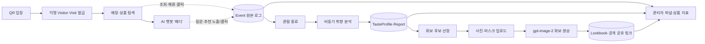
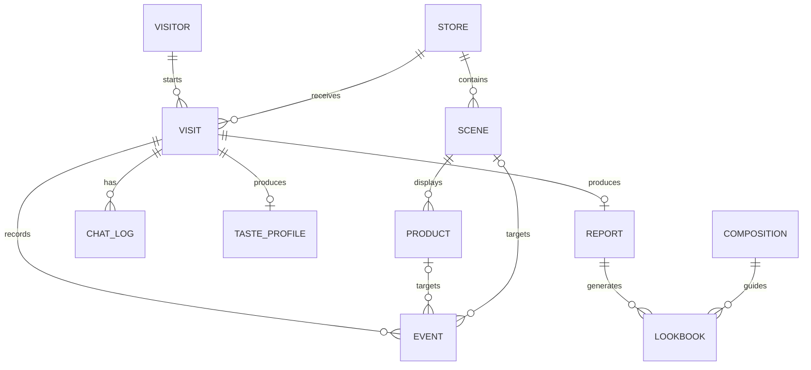

<div align="center">

# 🐻 O&O — MCM 인터랙티브 스토어 (Backend)

**매장 방문 행동을 취향 리포트·AI 상담·개인 화보로 연결하는 DRF API 서버**

_2026 멋쟁이사자처럼 중앙 해커톤 · 1조 오레오(O&O)_


</div>

---

## 📌 프로젝트 소개

**O&O**는 MCM 팝업스토어 방문객의 오프라인 행동을 모바일 경험과 연결하는 인터랙티브 리테일 서비스입니다.

백엔드는 단순히 상품 정보를 내려주는 서버가 아니라 방문 전체의 데이터 흐름을 책임집니다.

1. QR로 입장한 손님에게 익명 방문 자격을 발급하고,
2. 상품 조회·체류·클릭·질문 이벤트를 중복 없이 저장하고,
3. 현재 보고 있는 상품을 문맥으로 AI 챗봇 답변을 생성하고,
4. 관람 종료 후 행동 데이터를 분석해 개인 취향 리포트를 만들고,
5. 선택 상품·인물 사진·편집 레퍼런스를 결합해 AI 화보를 비동기로 생성하고,
6. 같은 이벤트를 브랜드 관리자용 퍼널·상품 관심 지표로 집계합니다.

즉, **입장 → 관람 → 대화 → 분석 → 화보 → 브랜드 지표**가 하나의 데이터 루프로 연결됩니다.

## 🗺️ 한눈에 보는 데이터 흐름



## ✨ 핵심 기능

### 1. 🎫 로그인 없는 익명 방문 세션

- `POST /api/v1/enter`에서 `anonymous_uuid`, `visit_id`, `visit_token`, 매장·전시존 정보를 발급합니다.
- 손님은 회원가입 없이 `X-Anonymous-UUID` + `X-Visit-Token` 헤더로 보호 API를 이용합니다.
- 브라우저가 닫혀도 진행 중인 방문을 이어갈 수 있고, 매장별 `N.014` 형식의 뮤즈 번호를 관리합니다.
- 실명·이메일·전화번호를 받지 않고 익명 UUID만 사용합니다.

📁 `apps/visits`, `api/authentication.py`

### 2. 📡 Append-only 행동 이벤트 수집

- `POST /api/v1/events`는 상품 조회(`product_view`), 체류(`product_dwell`), 핫스팟 클릭, 질문, 추천 클릭 등을 배치로 받습니다.
- 클라이언트가 만든 UUID `event_id`를 중복 제거 키로 사용해 재전송이 일어나도 지표가 부풀지 않습니다.
- 이벤트는 수정하지 않고 쌓는 원본 로그입니다. 취향 리포트와 브랜드 대시보드가 같은 데이터를 읽습니다.
- 체류시간은 `metadata.dwell_ms`로 저장하며 0 이상의 정수인지 서버에서 검증합니다.

📁 `apps/events/models.py`, `serializers.py`, `services.py`

### 3. 💬 상품 문맥을 유지하는 AI 챗봇 '패디'

- 진열대·상품 클릭을 채팅 타임라인에 쌓아 현재 방문객이 보는 상품을 대화 문맥으로 사용합니다.
- `POST /api/v1/chat`은 OpenAI 응답을 SSE로 스트리밍하고, `GET /api/v1/chat/messages`는 누적 타임라인과 현재 문맥을 반환합니다.
- 행동 패턴에 따라 서버가 먼저 선택지를 제안하는 선제 트리거를 지원합니다.
- AI 응답이 실패해도 시스템 문구와 추천 폴백으로 방문 흐름을 유지합니다.

📁 `apps/chat`, `common/llm.py`

### 4. 📈 비동기 개인 취향 리포트

- `POST /api/v1/visits/{visit_id}/finish`는 방문을 종료하고 리포트 slug를 `202 Accepted`로 즉시 반환합니다.
- 종료 직전 프론트 버퍼의 `events[]`도 함께 받아 이벤트 전송과 방문 종료 사이의 유실을 막습니다.
- 백그라운드 분석이 조회·체류·재방문·질문을 8개 취향 축으로 점수화해 `TasteProfile`과 `Report`로 박제합니다.
- `GET /api/v1/reports/{slug}`는 `pending / ready / failed` 상태와 키워드, 요약, 관심 상품, 추천, 전시존별 체류, 신뢰도를 반환합니다.

📁 `apps/analysis/collect.py`, `pipeline.py`, `taste.py`, `report.py`, `services.py`

### 5. 📷 사진 업로드 → ✨ AI 화보 생성

| 단계 | 백엔드 역할 |
| --- | --- |
| ① 후보 선정 | 방문 행동·리포트로 화보용 상품 6개를 점수화 |
| ② 업로드 준비 | 원본 사진·마스크 키와 PUT URL 발급 |
| ③ 입력 검증 | 리포트 소유권, 상품 ID, 동의, 파일 존재·크기·이미지 바이트 검증 |
| ④ 작업 수락 | `job_id`, `share_slug`, `poll_after_ms`를 `202`로 반환 |
| ⑤ AI 생성 | 인물 사진, 마스크, 상품 컷아웃, 편집 레퍼런스를 `gpt-image-2`에 역할별로 전달 |
| ⑥ 상태 조회 | Redis의 `queued / processing / ready / failed`, 진행률, 다음 폴링 주기 반환 |
| ⑦ 완성·공유 | PostgreSQL에 결과를 박제하고 인증 없는 공개 공유 API 제공 |

- 마스크가 없어도 생성은 계속되며 인물 보존 정도만 낮아질 수 있습니다.
- `STORAGE_BACKEND=local` 또는 `s3`를 지원하며 저장소가 바뀌어도 프론트 업로드 계약은 같습니다.
- 완성 화보는 절대 URL로 반환하고, 내부 레퍼런스는 `MEDIA_ROOT` 밖을 읽지 못하도록 검증합니다.

📁 `apps/lookbook`, `prompts.py`, `worker.py`

### 6. 📊 브랜드 관리자 지표

- 일반 방문 토큰과 분리된 JWT 관리자 인증을 사용합니다.
- 퍼널은 `입장 → 상품 조회 → 질문 → 관람 종료 → 리포트 → 화보`의 방문 수와 입장 대비 전환율을 제공합니다.
- 상품 지표는 조회 수, 총 체류시간, 핫스팟 클릭, 추천 노출·클릭, 클릭률, 화보 선택 횟수를 반환합니다.
- 별도 집계 테이블 대신 append-only 이벤트를 읽어 지표 정의가 바뀌어도 과거 데이터를 다시 해석할 수 있습니다.

📁 `apps/dashboard/services.py`, `views.py`

### 7. 🛡️ 통일된 API 계약과 보안 경계

- 모든 에러를 `{ "error": { "code", "message", "detail" } }` 형식으로 통일합니다.
- 손님, 관리자, 공개 공유 API의 인증 규칙을 분리합니다.
- Swagger에서 요청·응답 필드와 상태 코드를 바로 확인할 수 있습니다.
- 업로드 파일 크기, MIME, magic bytes, 저장 키 형식과 요청 속도를 서버에서 검증합니다.

📁 `api/exceptions.py`, `api/authentication.py`, `config/settings.py`

## 🛠️ 기술 스택

| 영역 | 선택 | 역할 |
| --- | --- | --- |
| Framework | Django 5.1 + DRF 3.15 | REST API, ORM, 관리자, 마이그레이션 |
| API Docs | drf-spectacular | OpenAPI 스키마 + Swagger UI |
| Database | PostgreSQL / SQLite | 배포는 PostgreSQL, 로컬 기본값은 SQLite(WAL) |
| Job Cache | Redis / LocMem | 배포 화보 상태는 Redis, 로컬 폴백은 LocMem |
| AI | OpenAI API | 챗봇, 취향 문장, `gpt-image-2` 화보 생성 |
| Storage | Local / S3·R2 | 원본 사진·마스크 업로드 추상화 |
| Auth | Visit Token + SimpleJWT | 익명 방문객과 브랜드 관리자 분리 |
| Runtime | Gunicorn WSGI + Nginx | SSE 스트리밍, 역방향 프록시, media 서빙 |
| Quality | Django TestCase + Ruff | 184개 테스트, 정적 검사·포맷 |

## 🚀 로컬 실행

### 1. 설치

```bash
git clone https://github.com/LikeLion-at-DGU/2026-hackathon-1-O-O-BE.git
cd 2026-hackathon-1-O-O-BE
python -m venv venv
```

macOS / Linux:

```bash
source venv/bin/activate
pip install -r requirements.txt
cp .env.example .env
```

Windows PowerShell:

```powershell
.\venv\Scripts\Activate.ps1
pip install -r requirements.txt
Copy-Item .env.example .env
```

### 2. DB·시드 준비

```bash
python manage.py migrate
python manage.py seed_demo
python manage.py seed_compositions
```

### 3. 서버 실행

```bash
python manage.py runserver
```

- API Base: `http://127.0.0.1:8000/api/v1/`
- Swagger: `http://127.0.0.1:8000/api/schema/swagger-ui/`
- Django Admin: `http://127.0.0.1:8000/django-admin/`

## 🔑 환경변수

`.env.example`을 복사해 `.env`를 만듭니다. 실제 키·토큰·비밀번호는 절대 커밋하지 않습니다.

| 키 | 설명 | 로컬 기본 동작 |
| --- | --- | --- |
| `DJANGO_SECRET_KEY` | Django 서명 키 | 필수 |
| `DATABASE_URL` | PostgreSQL 연결 URL | 비우면 SQLite |
| `REDIS_URL` | 화보 job 공유 캐시 | 비우면 LocMem |
| `OPENAI_API_KEY` | 챗봇·분석·화보 AI | 비우면 폴백/가짜 AI |
| `OPENAI_MODEL` | 챗봇·분석 모델 | `gpt-4o-mini` |
| `LOOKBOOK_IMAGE_MODEL` | 화보 이미지 모델 | `gpt-image-2` |
| `LOOKBOOK_FAKE_AI` | 실제 이미지 API 호출 여부 | `True` |
| `LOOKBOOK_COMPOSE_MODE` | `cutout` 또는 `ai` | `cutout` |
| `STORAGE_BACKEND` | `local`, `s3`, `dev` | `local` |
| `UPLOAD_LOCAL_ROOT` | 비공개 원본 사진 저장 경로 | `<repo>/uploads` |
| `CORS_ALLOWED_ORIGINS` | 허용할 프론트 출처 | localhost |

전체 키와 배포 예시는 [`.env.example`](.env.example), [`deploy/README.md`](deploy/README.md)를 참고하세요.

> 배포에서 Gunicorn worker가 둘 이상이면 `REDIS_URL`은 필수입니다. LocMem은 프로세스끼리 job 상태를 공유하지 못해 폴링이 404가 될 수 있습니다.

## 🏗️ 아키텍처

### 디렉터리 구조

```text
config/                 # settings, root URL, WSGI/ASGI
api/
├─ v1/                  # 도메인 URL 조합
├─ authentication.py   # 익명 방문 토큰 인증
└─ exceptions.py       # 통일 에러 응답
apps/
├─ visits/             # Visitor, Visit, 입장·이어하기
├─ catalog/            # Store, Scene, Product, 8개 취향 축
├─ events/             # append-only 행동 이벤트
├─ chat/               # 채팅 타임라인, SSE, 선제 트리거
├─ analysis/           # 취향 점수, 캐릭터, Report
├─ lookbook/           # 후보, 업로드, job, 프롬프트, 이미지 생성
└─ dashboard/          # JWT 관리자 퍼널·상품 지표
common/                # ID 생성, OpenAI JSON 게이트웨이
deploy/                # Gunicorn·systemd·Nginx 배포 가이드
docs/                  # 필드 계약·구현 판단 기록
tools/                 # MCM 상품 수집·fixture 생성 도구
```

### 주요 데이터 모델



- `Event`는 사용자 행동의 원본입니다.
- `Report.payload`는 생성 시점의 상품·추천 결과를 박제해 나중에 상품이 바뀌어도 같은 리포트를 보여줍니다.
- `Lookbook`은 현재 상태와 완성 결과를 PostgreSQL에 남기고, 짧게 변하는 진행 상태는 Redis에 보관합니다.

## 🔌 주요 API

모든 경로의 prefix는 `/api/v1`입니다.

| Method | URL | 역할 | 접근 |
| --- | --- | --- | --- |
| `POST` | `/enter` | 익명 방문 시작·이어하기 | 공개 |
| `GET` | `/products/{product_id}` | 상품 상세 | 방문 토큰 |
| `POST` | `/events` | 행동 이벤트 배치 저장 | 방문 토큰 |
| `GET` | `/chat/messages` | 채팅 타임라인·현재 문맥 | 방문 토큰 |
| `POST` | `/chat/messages` | 클릭·선택·트리거 응답 저장 | 방문 토큰 |
| `POST` | `/chat` | AI 챗봇 SSE 응답 | 방문 토큰 |
| `POST` | `/visits/{visit_id}/finish` | 관람 종료 + 분석 시작 | 방문 토큰 |
| `GET` | `/reports/{slug}` | 리포트 상태·결과 | 방문 토큰 |
| `GET` | `/reports/{slug}/lookbook/candidates` | 화보 상품 후보 | 방문 토큰 |
| `POST` | `/uploads/presign` | 사진·마스크 업로드 URL 발급 | 방문 토큰 |
| `PUT` | `/uploads/{key}` | local 저장소 업로드 | 발급된 키 |
| `POST` | `/reports/{slug}/lookbook` | 화보 생성·재생성 | 방문 토큰 |
| `GET` | `/lookbooks/jobs/{job_id}` | 화보 진행 상태 폴링 | job ID |
| `GET` | `/lookbooks/{share_slug}` | 완성 화보 공유 | 공개 |
| `POST` | `/admin/auth` | 관리자 access token 발급 | 공개·제한 |
| `GET` | `/admin/funnel` | 방문 전환 퍼널 | 관리자 JWT |
| `GET` | `/admin/products` | 상품별 조회·체류·추천·선택 지표 | 관리자 JWT |

세부 필드는 [API 필드 가이드](docs/필드_가이드.md)와 Swagger에서 확인할 수 있습니다.

## 🔐 인증 방식

| 대상 | 헤더 / 방식 |
| --- | --- |
| 익명 방문객 | `X-Anonymous-UUID`, `X-Visit-Token` |
| 브랜드 관리자 | `Authorization: Bearer <access_token>` |
| 화보 상태 | 추측하기 어려운 `job_id` |
| 화보 공유 | 추측하기 어려운 `share_slug` |

관리자 계정은 Django superuser로 생성하며 `username`에 이메일을 입력합니다.

```bash
python manage.py createsuperuser
```

## ⚠️ 통일 에러 응답

```json
{
  "error": {
    "code": "VALIDATION_ERROR",
    "message": "입력값이 올바르지 않습니다.",
    "detail": {
      "product_ids": ["unknown_product"]
    }
  }
}
```

| HTTP | 대표 코드 | 의미 |
| --- | --- | --- |
| `400` | `VALIDATION_ERROR` | 필드·파일·상품 ID 검증 실패 |
| `401` | `INVALID_VISIT_TOKEN`, `UNAUTHORIZED` | 방문 또는 관리자 인증 실패 |
| `403` | `FORBIDDEN` | 다른 방문의 리소스에 접근 |
| `404` | `NOT_FOUND` | 리소스 없음 |
| `409` | `CONFLICT` | 리포트·화보 상태 충돌 |
| `429` | `RATE_LIMITED` | 요청 빈도·재생성 제한 |
| `500` | `INTERNAL_ERROR` | 예상하지 못한 서버 오류 |

## 🌐 배포 구조

```text
Netlify Frontend
        │ HTTPS API
        ▼
      Nginx ─── /media/ ───▶ MEDIA_ROOT
        │ proxy
        ▼
Gunicorn WSGI (Django/DRF)
   ├─ PostgreSQL : 방문·이벤트·리포트·화보 영구 데이터
   ├─ Redis      : 화보 job 진행 상태·폴링 캐시
   ├─ uploads/   : 비공개 원본 사진·마스크
   └─ media/     : 상품 컷아웃·편집 레퍼런스·완성 화보
        │
        └─ OpenAI API : 챗봇·취향 문장·AI 이미지
```

SSE 챗봇은 현재 동기 제너레이터를 사용하므로 배포에서 Gunicorn WSGI `gthread`를 사용합니다.

```bash
gunicorn config.wsgi:application \
  --bind 127.0.0.1:8000 \
  --worker-class gthread \
  --workers 2 \
  --threads 4 \
  --timeout 300
```

서버 배포·systemd·Nginx·PostgreSQL·Redis 설정은 [`deploy/README.md`](deploy/README.md)를 참고하세요.

## 🧪 테스트·검증

```bash
python manage.py check
python manage.py makemigrations --check --dry-run
python manage.py migrate
python manage.py test
ruff check .
ruff format --check .
```

현재 **184개 테스트**가 아래 계약을 검증합니다.

| 도메인 | 주요 검증 내용 |
| --- | --- |
| Visits | 신규 입장, 이어하기, 만료, 방문 토큰 |
| Events | 배치 저장, UUID 중복 제거, 체류 검증, 잘못된 참조 |
| Chat | 타임라인, 문맥, 선제 트리거, AI 실패 폴백 |
| Analysis | 취향 점수, 캐릭터, 추천, 비동기 리포트 |
| Lookbook | 후보, 업로드, 작업 상태, 재생성 제한, 공유 |
| Dashboard | JWT 권한, 입장 대비 퍼널, 상품별 지표 |
| API Contract | Swagger, 통일 에러, 400·401·403·404·409·429 분기 |

## 📊 서버에서 상품 지표 확인

배포 서버의 Django shell에서 조회·체류·추천·화보 선택 지표를 읽을 수 있습니다.

```bash
cd /srv/oando
sudo -u oando ./venv/bin/python manage.py shell -c "from apps.dashboard.services import product_stats; from pprint import pprint; pprint(product_stats('s_mcm'))"
```

응답의 `views`, `dwell_ms`, `recommendation_impressions`, `recommendation_clicks`, `click_rate`, `lookbook_picks`가 핵심 지표입니다.

## 📖 문서

- [API 필드 가이드](docs/필드_가이드.md) — 프론트엔드가 보내고 받는 필드의 의미
- [구현 기록](docs/구현_기록.md) — 구조 선택 이유와 버린 대안
- [배포 가이드](deploy/README.md) — 서버 설치·환경변수·배포 절차
- [수집 도구](tools/README.md) — MCM 상품 CSV·fixture 생성
- [기획](기획.md) · [결정 사항](tasks/결정사항.md) · [마일스톤](tasks/마일스톤.md)

## 🤝 협업 규칙

- 한 커밋에는 하나의 논리적 변경만 담습니다.
- 커밋 메시지는 `feat:`, `fix:`, `test:`, `docs:`, `refactor:`, `chore:` 접두어를 사용합니다.
- API 응답 스키마·URL·인증 방식을 바꾸면 Swagger와 프론트 팀에 같이 공유합니다.
- 환경변수를 추가하면 실제 값은 `.env`, 키 이름만 `.env.example`에 반영합니다.
- 마이그레이션은 수정·삭제하지 않고 새 파일로 추가합니다.

## 👥 팀

멋쟁이사자처럼 2026 중앙 해커톤 1조 **오레오(O&O)** — Backend Repository.
