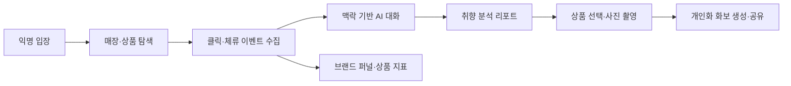

# O&O Backend

> 매장을 걷는 행동이 취향이 되고, 취향이 한 장의 화보가 되는 인터랙티브 리테일 플랫폼

O&O는 로그인 없이 오프라인 매장을 둘러보는 고객의 클릭·체류·대화 데이터를 수집해
개인 취향 리포트와 AI 화보를 만들고, 같은 데이터를 브랜드 운영 대시보드로 연결합니다.

이 저장소는 방문 세션, 상품 탐색, 행동 이벤트, 컨텍스트 챗봇, 취향 분석, 화보 생성,
브랜드 지표를 담당하는 Django REST Framework 백엔드입니다.

## 서비스 흐름



### 핵심 기능

| 기능 | 구현 내용 |
| --- | --- |
| 익명 방문 | 회원가입 없이 UUID와 `visit_token`을 발급하고, 3시간 안에는 진행 중인 관람을 이어받습니다. |
| 매장 탐색 | 전시존과 상품 데이터를 제공하고, 가격·소재·디자인 프리셋 답변을 함께 내려줍니다. |
| 행동 수집 | 클릭·체류·추천·화보 이벤트를 배치로 저장하며 `event_id` 기준으로 재전송을 안전하게 처리합니다. |
| 컨텍스트 챗봇 | 최근 타임라인과 보고 있던 상품을 서버에서 조합해 SSE로 답변을 스트리밍합니다. |
| 취향 리포트 | 8개 상품 축과 행동 데이터를 분석해 키워드, 추천 상품, 관심 상품, 신뢰도를 생성합니다. |
| AI 화보 | 추천 후보 선택 → 사진·마스크 업로드 → 비동기 생성 → 진행률 폴링 → 공유 링크 흐름을 제공합니다. |
| 브랜드 대시보드 | 입장부터 화보까지의 퍼널과 상품별 조회·체류·추천·선택 지표를 제공합니다. |

## 설계 포인트

- **사용자와 관리자의 인증 분리**: 고객은 `X-Visit-Token`, 브랜드 관리자는 JWT Bearer 토큰을 사용합니다.
- **멱등한 데이터 수집**: 이벤트 재전송과 관람 종료 재호출이 중복 데이터를 만들지 않습니다.
- **공유 결과의 불변성**: 리포트와 완성 화보는 생성 시점의 결과를 저장해 이후 로직이 바뀌어도 공유 링크가 변하지 않습니다.
- **비동기 UX**: 분석은 리포트 `slug`, 화보 생성은 `job_id`를 즉시 반환하고 상태 조회 API로 진행 상황을 전달합니다.
- **스토리지 교체 가능**: 로컬 업로드와 S3 호환 스토리지가 같은 API 계약을 사용합니다.
- **일관된 실패 응답**: 인증·검증·충돌·제한 오류를 하나의 JSON 형식으로 반환합니다.

```json
{
  "error": {
    "code": "VALIDATION_ERROR",
    "message": "입력값이 올바르지 않습니다.",
    "detail": null
  }
}
```

## 기술 스택

| 영역 | 기술 |
| --- | --- |
| API | Python 3.12, Django 5.1, Django REST Framework 3.15 |
| 인증·문서 | Simple JWT, drf-spectacular, Swagger UI |
| AI | OpenAI API, SSE 스트리밍, Pillow 기반 이미지 합성 |
| 데이터 | SQLite/WAL 로컬 개발, PostgreSQL 운영, Redis 작업 상태 캐시 |
| 파일 | 로컬 비공개 업로드, S3·R2 호환 스토리지 |
| 운영 | Gunicorn WSGI, Nginx, WhiteNoise, GitHub Actions |
| 품질 | Django TestCase, Ruff |

## 빠른 시작

### 1. 설치

```bash
git clone https://github.com/LikeLion-at-DGU/2026-hackathon-1-O-O-BE.git
cd 2026-hackathon-1-O-O-BE

python3 -m venv venv
source venv/bin/activate
pip install -r requirements.txt
```

Windows PowerShell에서는 가상환경 활성화 명령으로 `venv\Scripts\Activate.ps1`을 사용합니다.

### 2. 환경변수

```bash
cp .env.example .env
```

`.env`에서 최소한 다음 값을 설정합니다.

```dotenv
DJANGO_SECRET_KEY=충분히-긴-임의의-문자열
DEBUG=True
```

챗봇 또는 실제 AI 이미지 생성을 사용하려면 `OPENAI_API_KEY`도 입력합니다.
기본값인 `LOOKBOOK_FAKE_AI=True`에서는 이미지 생성 API를 호출하지 않고도 화보 전체 흐름을 테스트할 수 있습니다.

| 변수 | 용도 | 로컬 기본값 |
| --- | --- | --- |
| `DATABASE_URL` | 운영 PostgreSQL 연결 | 비어 있으면 SQLite |
| `REDIS_URL` | 화보 작업 상태 공유 | 비어 있으면 프로세스 내부 캐시 |
| `OPENAI_API_KEY` | 챗봇·취향 추출·AI 이미지 생성 | 없음 |
| `STORAGE_BACKEND` | `local`, `s3`, `dev` 중 선택 | `local` |
| `LOOKBOOK_FAKE_AI` | 비용 없이 화보 흐름 테스트 | `True` |
| `LOOKBOOK_COMPOSE_MODE` | 원본 보존 합성 `cutout` 또는 AI 편집 `ai` | `cutout` |

전체 설정과 운영용 값은 [`.env.example`](.env.example)과 [`deploy/README.md`](deploy/README.md)를 참고하세요.

### 3. 데이터 준비 및 실행

```bash
python manage.py migrate
python manage.py seed_demo
python manage.py seed_compositions
python manage.py runserver
```

- API 문서: <http://127.0.0.1:8000/api/schema/swagger-ui/>
- Django 관리자: <http://127.0.0.1:8000/django-admin/>

브랜드 대시보드 인증까지 확인하려면 관리자를 만듭니다.

```bash
python manage.py createsuperuser
```

## API

모든 엔드포인트의 기준 경로는 `/api/v1`입니다.

| Method | Endpoint | 인증 | 설명 |
| --- | --- | --- | --- |
| `POST` | `/enter` | 공개 | 익명 방문자·관람 세션 발급 또는 이어하기 |
| `GET` | `/products/{product_id}` | Visit | 상품 상세와 프리셋 답변 조회 |
| `POST` | `/events` | Visit + UUID | 행동 이벤트 배치 수집 |
| `POST` | `/chat/messages` | Open Visit | 클릭·선택을 대화 타임라인에 기록 |
| `GET` | `/chat/messages?visit_id=...` | Visit | 대화 타임라인과 현재 문맥 복원 |
| `POST` | `/chat` | Open Visit | 컨텍스트 챗봇 SSE 스트리밍 |
| `POST` | `/visits/{visit_id}/finish` | Visit | 관람 종료와 취향 분석 접수 |
| `GET` | `/reports/{slug}` | 공개 링크 | 취향 리포트 상태·결과 조회 |
| `GET` | `/reports/{slug}/lookbook/candidates` | Visit | 화보에 사용할 추천 상품 후보 조회 |
| `POST` | `/uploads/presign` | Visit | 사진·마스크 업로드 URL 발급 |
| `PUT` | `/uploads/{key}` | 서명 URL | 로컬 스토리지 사용 시 원본 업로드 |
| `POST` | `/reports/{slug}/lookbook` | Visit | 화보 생성 또는 재생성 접수 |
| `GET` | `/lookbooks/jobs/{job_id}` | 공개 ID | 화보 생성 상태·진행률 조회 |
| `GET` | `/lookbooks/{share_slug}` | 공개 링크 | 완성 화보 조회·공유 |
| `POST` | `/admin/auth` | 공개 | 관리자 JWT 발급 |
| `GET` | `/admin/funnel` | Admin JWT | 방문 퍼널 조회 |
| `GET` | `/admin/products` | Admin JWT | 상품별 관심·전환 지표 조회 |

### 인증 헤더

```http
X-Visit-Token: <POST /enter에서 받은 visit_token>
X-Anonymous-UUID: <POST /enter에서 받은 anonymous_uuid>
```

관리자 API는 다음 헤더를 사용합니다.

```http
Authorization: Bearer <POST /admin/auth에서 받은 access_token>
```

## 테스트와 코드 품질

```bash
python manage.py makemigrations --check --dry-run
python manage.py check
python manage.py test
ruff check .
ruff format --check .
```

184개의 자동화 테스트가 API 공통 오류, 방문 인증, 이벤트 멱등성, 챗봇 타임라인과 SSE,
취향 분석, 화보 업로드·생성·폴링, 관리자 지표를 검증합니다.

## 프로젝트 구조

```text
api/                     공통 인증·권한·오류 형식·v1 라우팅
apps/
  visits/                익명 방문자와 관람 세션
  catalog/               매장·전시존·상품과 데모 데이터
  events/                append-only 행동 이벤트
  chat/                  타임라인, 취향 가설, SSE 챗봇
  analysis/              취향 프로필과 공유 리포트
  lookbook/              업로드, 상품 후보, 화보 생성·공유
  dashboard/             브랜드 퍼널과 상품 지표
common/                  LLM·이미지 생성·공통 식별자
config/                  Django 설정과 루트 URL
deploy/                  Nginx·Gunicorn·systemd 운영 설정
docs/                    API 연동·테스트·배포 문서
tools/                   상품 데이터 수집 도구
```

## 문서

- [API 필드 가이드](docs/필드_가이드.md)
- [컨텍스트 챗봇 명세](docs/명세_컨텍스트챗봇.md)
- [채팅 액션 메시지 명세](docs/명세_액션메시지.md)
- [화보 API·프론트 연동 가이드](docs/화보_API_프론트연동.md)
- [직접 테스트 가이드](docs/테스트_가이드.md)
- [배포 가이드](deploy/README.md)

## 배포

운영 환경은 Nginx에서 HTTPS를 종료하고 Gunicorn WSGI로 Django를 실행합니다.
챗봇 응답이 동기 SSE 제너레이터이므로 현재 운영 서버는 ASGI가 아니라 WSGI를 사용합니다.

`main` 브랜치에 변경이 들어오면 GitHub Actions가 Ruff, 마이그레이션 검사,
전체 테스트를 통과한 경우에만 배포 스크립트를 실행합니다.
